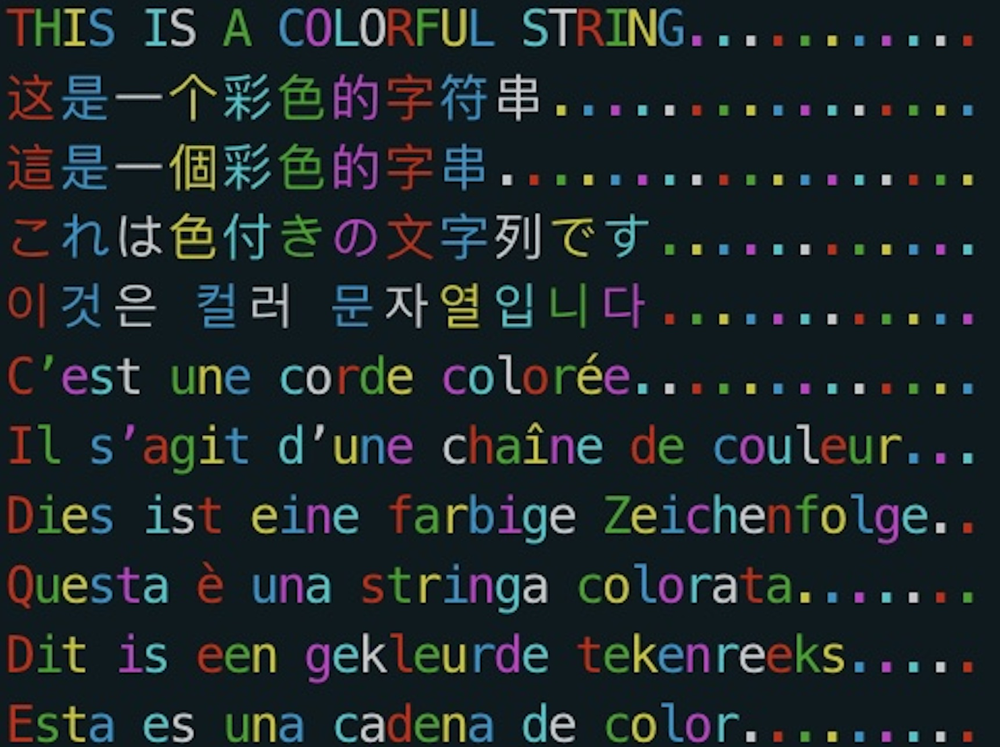

# Colorful String

Dye your string with color when printing it.

Are you a programmer willing to try something new?

Are you bored with you single-color command line output text(like the following)?


Are you looking for decorations for your command line tool?

## Example

```shell
$ git clone git@github.com:treasersimplifies/cstr.git
$ cd cstr
$ go test
```

and you will see:



## Installation

To install cstr package, you need to install Go first.

Install cstr:

```shell
go get github.com/treasersimplifies/cstr
# or:
go get -u github.com/treasersimplifies/cstr@master
```
Import cstr in your code:

```go
import "github.com/treasersimplifies/cstr"
```

Use in code:

```go

fmt.Println(cstr.Dye("This is a Red string.....", "Red"))
fmt.Println(cstr.DyeColorfully("THIS IS A COLORFUL STRING...........\n", []string{"Red", "Green", "Yellow", "Blue", "Pink", "Skyblue", "White"}))

```
